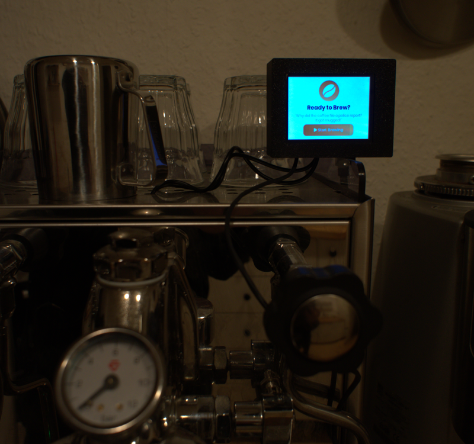
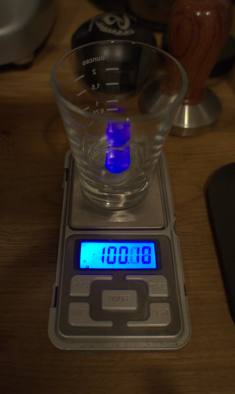
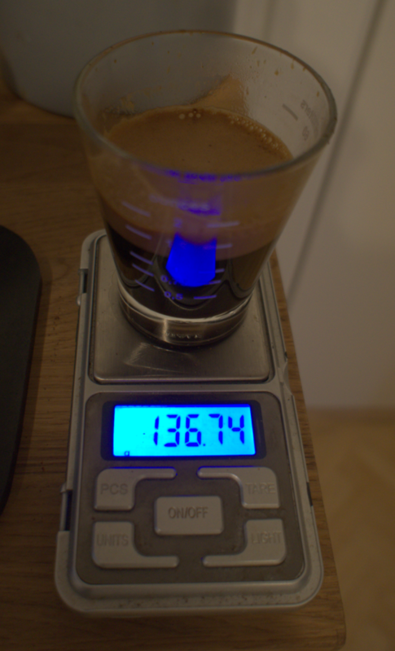

# Rocket Gravimetric Espresso

Rocket Gravimetric Espresso is a personal project aimed at modifying my Rocket Espresso machine into a gravimetric (brew-by-weight) machine.
This allows precise measurement and control of espresso extraction, improving consistency and precision in every shot.

## Features

- Brew-by-Weight Control: The system monitors the espresso shot’s weight in real-time and automatically stops the extraction when the desired ratio is reached.
- UI: A responsive TFT touchscreen interface for data on shot weight, extraction time, and shot settings.

| Cup weight (reference 100.1g) | Cup + extraction weight (reference 136.74g) |
|:---:|:---:|
|  |  |

The reference cup was also used for loadcell calibration. The extraction here is at 36.64g - close to the 36g target (18g dose at a 1:2 ratio).

## Hardware used

- MCU: Nordic nRF52840
- TFT touch: Adafruit 2.8" Capacitive
- SparkFun 500g loadcell
- NAU7802SGI 24 bit ADC
- TCK108AF load switch IC

## Software and tools

- Zephyr RTOS for [firmware](https://github.com/Rocket-Gravimetric-Espresso/firmware)
- KiCAD for [PCB design](https://github.com/Rocket-Gravimetric-Espresso/hardware)

## Current limitations

The E61 group head lever not only activates the pump via a switch, but also mechanically opens the pre-infusion valves. Because of this, the lever must still be operated manually for my controller to work. To make the process fully automatic, the lever would need to be controlled as well - by a DC motor, servo or similar mechanism to rotate it.

